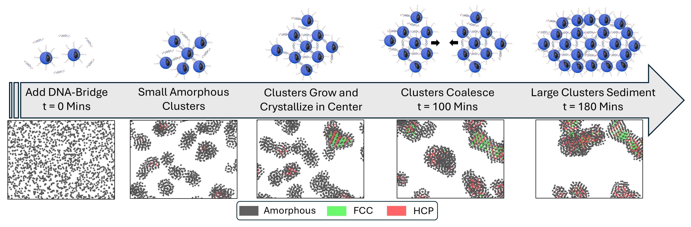

I am currently a researcher at Johns Hopkins University. My research intrests center on colloidal self-assembly, and AI-driven autonomous experimentation. My work combines high-throughput experimentation, molecular simulations, and optimization algorithms to explore how nanoparticles, particularly DNA-coated silica particles, organize into larger structures. By bridging experimental characterization with computational modeling, I aim to uncover the fundamental principles that govern nucleation, growth, and structural transitions in colloidal systems.

On the computational side, I have extensive experience with computational simulations, modeling particle interactions with potentials, as well as analyzing simulation outputs using structure factors and scattering methods. I have also developed methods to optimize simulation potentials that reproduce experimental SAXS data, bridging the gap between simulation and experiment.

Beyond colloids, I maintain a strong interest in electrochemistry, particularly electrochemical impedance spectroscopy (EIS), as tools to study ion transport, interfacial processes, and charge storage. I enjoy exploring connections between scattering techniques, spectroscopy, and simulation frameworks to develop a more unified understanding of structure–property relationships across soft matter and energy systems.

At the intersection of materials science, computation, and automation, my broader goal is to advance self-driving laboratory approaches for nanomaterial discovery, where robotic experimentation, real-time data analysis, and machine learning converge to accelerate innovation.

  

------

**Markdown generator**

For more info
------
More info about configuring Academic Pages can be found in [the guide](https://academicpages.github.io/markdown/), the [growing wiki](https://github.com/academicpages/academicpages.github.io/wiki), and you can always [ask a question on GitHub](https://github.com/academicpages/academicpages.github.io/discussions). The [guides for the Minimal Mistakes theme](https://mmistakes.github.io/minimal-mistakes/docs/configuration/) (which this theme was forked from) might also be helpful.
