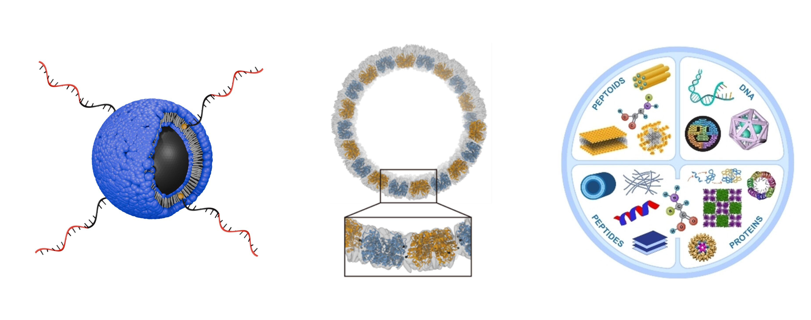

## Overview 
Currently, my work involves electrochemistry, particularly electrochemical impedance spectroscopy (EIS) and quasielastic neutron scattering (QENS), as a tool to study ion transport, interfacial processes, and charge storage. My goal is to establish connections between scattering techniques, spectroscopy, and simulation frameworks to develop a more unified understanding of structure-dynamics-property relationships across soft matter and energy systems. At the intersection of materials science, computation, and automation, my broader goal is to advance self-driving laboratory approaches for nanomaterial discovery, where high-throughput experimentation, real-time data analysis, and machine learning converge to accelerate innovation.

## High-Throughput Experimentation and Machine Learning 
The collection of large datasets is critical for advancing our understanding of complex material systems. High-throughput experimentation, when combined with machine learning, provides a powerful framework for autonomously generating such datasets. Nevertheless, important challenges remain, such as the development of autonomous data analysis methods, the integration of multimodal characterization techniques, and the interpretation of machine learning models to extract meaningful scientific insights. To address these challenges, I have implemented and tested several strategies on data-driven frameworks for the synthesis of plasmonic nanoparticles. 

  

  <a href="https://pubs.rsc.org/en/content/articlehtml/2024/dd/d4dd00211c">[Data-driven exploration of silver nanoplate formation in multidimensional chemical design spaces]</a>

  <a href="https://pubs.rsc.org/en/content/articlehtml/2022/dd/d2dd00025c">[Autonomous retrosynthesis of gold nanoparticles via spectral shape matching]</a>

## Biomolecular Self-Assembly 
Biomolecules are the most complex materials known to mankind, and are responsible for most of the physiological processes that make life possible. Their function arises from intricate assemblies of proteins, DNA, peptides, lipids, and other components. My research focuses on understanding and designing such self-assembling biomolecular systems, particularly by uncovering sequence-level design rules that drive the formation of complex structures.

  

  <a href="https://www.cell.com/chem/abstract/S2451-9294(24)00652-1">[Design of light- and chemically responsive protein assemblies through host-guest interactions]</a>

## Computer Simulations 
Computational simulations are powerful tools for uncovering insights that are often difficult to obtain through experimental characterization alone. My work in this area focuses on modeling particle interactions using pair potentials and analyzing simulation outputs through structure factors and scattering methods. In addition, I have developed approaches to optimize simulation potentials that reproduce experimental SAXS data, bridging the gap between simulation and experiment. 

  

## X-ray and Neutron Scattering 
Scattering-based characterization, in particular, small-angle X-ray and neutron scattering are fundamental tools to understand the structure of nanomaterials. These techniques are used to characterize structural features ranging from angstroms to hundreds of nanometers, and can be applied to a wide range of material systems such as proteins, lipids, nanoparticles, polymers, etc. Data acquisition and analysis can be performed in high-throughput making them a powerful tool for nanomaterial characterization. A significant part of my research was performed at various large scale facilities (synchrotrons, neutron sources, and XFEL). 

  

Data analysis from small-angle scattering, especially from large strutcures, can be challenging to model. One reason for this is because the computational cost to simulate a small-angle scattering curve increases exponentially as the size of the object increases. To overcome this, I developed software that can analyze and fit scattering data from large structures without the cost increasing with size. This work has been applied to fit data from several large protein assemblies, including a collaboration with David Baker's group. 

  

